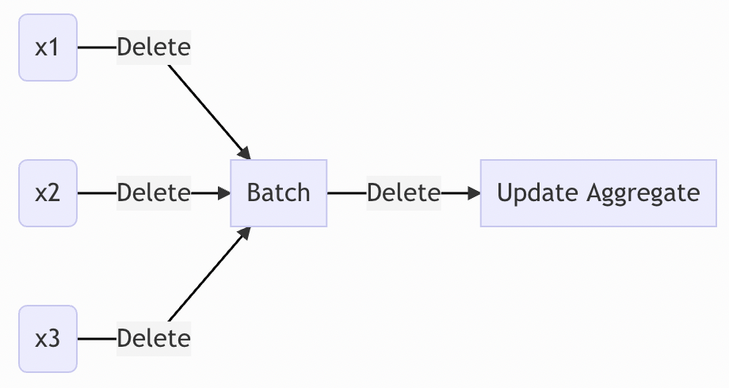

stats\_batch
================
Christopher Gandrud

[](https://github.com/christophergandrud/stats_batch/actions)
[](.coverage)

**In Development**

**stats\_batch** is a Python package for finding approximate statistics
using batch updating. Currently it supports:

- mean

- variance

- sum of squared deviations

- sample size

## Motivation

Imagine we have a stream of data and we want to make some descriptive
and statistical inferences with it. Rather than storing all of the data
and calculating statistics all at once, we can update the statistics as
new batches of data come in.



Batch updating has at least two advantages:

-   We don’t need to store all of the data, only a small number of
    sufficient statatistics. This makes the calculations very fast.

-   Because we don’t need to store all of the data, we can minimise the
    amount of potentially sensitive personal data we need to store.

The key downside, is that due to rounding error, batch updated
statistics are not exact. Though the rounding error is typically not
substantively large (see [here](https://elegant-heyrovsky-54a43f.netlify.app/privacy-first-ds-mean-var.html)).

See
[here](https://elegant-heyrovsky-54a43f.netlify.app/privacy-first-ds-mean-var.html)
for more details on the motivation, algorithms, and sources.

## Install

Currently, you can install stats-batch from Test PyPi:

```bash
pip3 install -i https://test.pypi.org/simple/ stats-batch
```

## Example

### Minimal example: mean and variance

Currently, **stats_batch** supports updating the mean and variance of an array of numbers using `sb.mean_var_batch` and the `update` method. 
Here is a minimal example

``` python
import numpy as np
import stats_batch as sb

# Simulate data
n = 10_000
x = np.random.normal(size=n)

# First batch
batch_1_a = a[:100]  
a_current = sb.mean_var_batch(batch_1_a)

# Update with inputs from a second batch
batch_2_a = a[100:n]
a_current.update(batch_2_a)

a_current.print()
##    mean   var  sum_squared_dev  sample_size
## 0   2.5  1.25              5.0            4
```

### Output

You can output the statistics using the following methods:

- `print()`

- `to_pandas()`

- `to_csv(filename)`

For example:

```python
sb.mean_var_batch([1,2,3,4]).to_pandas()
##    mean   var  sum_squared_dev  sample_size
## 0   2.5  1.25              5.0            4
```

### Compare difference of means of two samples

Imagine we have an A/B test and want to ultimately calculate the
difference of means of the A and B groups.

First, for the sake of this example let’s simulate the data and create a
function that allows us to pretend the data is coming in as batches:

```python
import stats_batch.mean_var_batch as sb
import numpy as np
import stats_batch as sb
from scipy.stats import ttest_ind
from itertools import islice

# ----------------------------------------------------------------
"""
Simulate batched A/B test data
"""
# Simulate full samples
n = 10_000
batch_n = 1_000
a = np.random.normal(size=n, loc=0.1)
b = np.random.normal(size=n, loc=0.01)
```

Now let's batch update the data as it "comes in".

```python
"""
Batch update sufficient stattistics
"""
# Group A
for i, new_list in enumerate(sb.group_elements(a , batch_n)):
    if i == 0:
        mean_var_a = sb.mean_var_batch(new_list)
    else:
        mean_var_a.update(new_list)

# Group B
for i, new_list in enumerate(sb.group_elements(b , batch_n)):
    if i == 0:
        mean_var_b = sb.mean_var_batch(new_list)
    else:
        mean_var_b.update(new_list)
```

Finally, we run a t-test on the batch updated data. 

```python
# Compare means of A and B using batch updated sufficient statistics

mean_var_a.ttest_ind(mean_var_b)

## Ttest_indResult(statistic=6.541321847403076, pvalue=6.245323161218439e-11)
```

Notice that the t-test results from the batch updated data are very similar to the t-test results using the full samples, without batch updating.

```python
# Compare to t-test using full samples
ttest_ind(a, b)

## Ttest_indResult(statistic=6.541321847403074, pvalue=6.245323161218484e-11)
```

## Ambition

Version 0.1 of **stats_batch** provides the sufficient statistics needed to analyse the difference of means of two samples using a t-test. The near-ish term ambition of the package is to enable:

- enable Bayesian updating for inference as new data comes in

- enable regression adjustment through recursive least squares (e.g. [Harvey 1990](https://mitpress.mit.edu/books/econometric-analysis-time-series-second-edition)). This could, for example, be used for variance reduction in the analysis of A/B tests ([Deng et al.'s (2013)](https://exp-platform.com/Documents/2013-02-CUPED-ImprovingSensitivityOfControlledExperiments.pdf) CUPED method). 

## Sources

- Chou (2021) "Randomized Control Trials with Minimal Data Retention" <https://arxiv.org/abs/2102.03316>.

- Chan et al. (1983). "Algorithms for computing the sample variance: Analysis and recommendations". <http://www.cs.yale.edu/publications/techreports/tr222.pdf>

Note that there appears to be a typo in Chou's paper (as of March 2021) for the variance formula. It is corrected in `stats_batch` using Chane et al. (1983).
